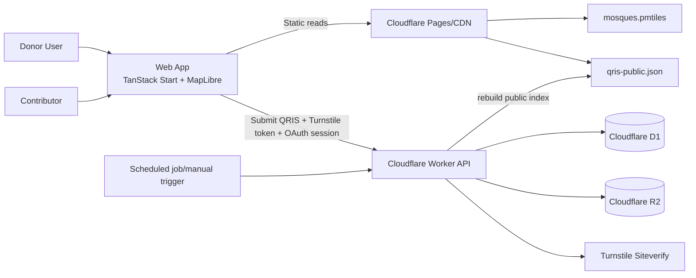
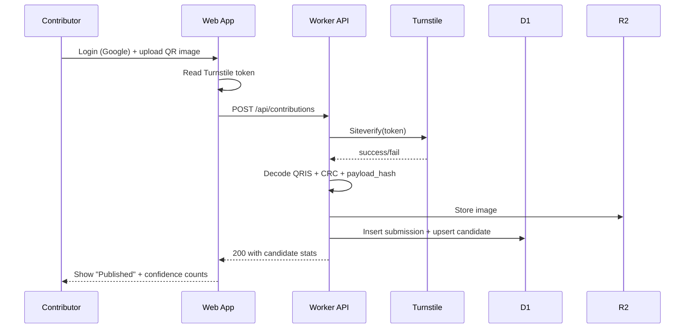
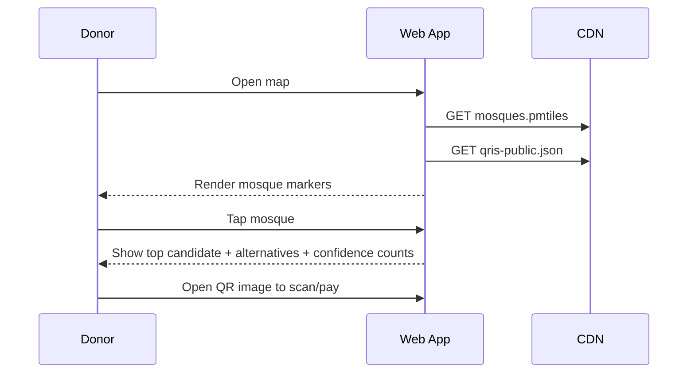
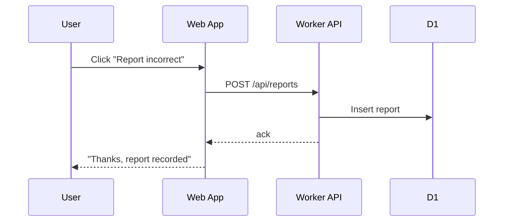

# QRIS Masjid Indonesia - MVP Spec (Hackathon, 1 Day)

Last updated: 2026-03-03
Status: Draft v1

## 1) Product Goal

Build a nationwide, low-friction directory of QRIS donation endpoints for mosques in Indonesia.

- Publish-first: show candidate QRIS after first valid submission.
- Not arbiter of truth: expose confidence metadata so users self-assess.
- Static-first reads: map + mosque data + public QRIS index served as static assets.
- Minimal write backend: only for submissions, reports, and anti-abuse.

## 2) Non-goals (MVP)

- No manual verification team workflow.
- No mosque-ownership claim flow.
- No bank-grade payment validation.
- No native mobile app.

## 3) Core Product Principles

- Transparency over hard claims: show counts, not "verified" badge claims.
- Fast contribution path: Google login + Turnstile + upload.
- Operationally tiny: static read path, small Cloudflare write path.
- Recoverable by design: conflicts visible via alternatives and report channel.

## 4) Why PMTiles (and answer to "do I need a separate server?")

Short answer: no separate tile server required.

PMTiles is a single static file. MapLibre reads only needed byte ranges over HTTP. Host it on Cloudflare R2/Pages like any static asset.

### PMTiles vs GeoJSON decision

- If dataset is tiny (< 5-10 MB compressed), GeoJSON is simpler.
- If dataset is nationwide POI and expected growth, PMTiles is better with similar ops complexity.
- For this project: use PMTiles now.

## 5) Recommended Full TypeScript Stack

## Frontend
- TanStack Start (React) + TanStack Router (file-based)
- TanStack Query (cache/server-state)
- Zod (runtime validation + typed contracts)
- MapLibre GL JS + pmtiles
- Tailwind CSS + shadcn/ui (fast component primitives)

## Backend (minimal)
- TanStack Start Server Routes / Server Functions
- Cloudflare Workers runtime
- Cloudflare D1 (metadata)
- Cloudflare R2 (QR images)
- Cloudflare Turnstile (bot mitigation)
- Google OAuth (identity)

## Data + Migrations
- Drizzle ORM + drizzle-kit (recommended default)

## Observability
- Sentry (errors)
- Basic analytics (OpenPanel or PostHog)

## Tooling
- Bun (runtime/package manager)
- TypeScript strict mode
- Biome (format/lint)
- Vitest (unit)
- Playwright (e2e)

## 6) Drizzle vs Atlas (Migration decision)

Recommendation: start with **Drizzle + drizzle-kit**.

Why for MVP:
- Native TypeScript schema in app repo.
- Direct D1 support and D1 HTTP workflow.
- Fewer moving parts for day-1 shipping.

When Atlas becomes useful:
- Multi-service DB ownership.
- Stronger migration governance/linting/check policies in CI.
- Cross-language schema pipelines.

Pragmatic path:
- Day 1: Drizzle migrations.
- Later: optionally layer Atlas in CI using Drizzle export/integration workflow.

## 7) High-level Architecture



## 8) Data Artifacts

- `public/data/mosques.pmtiles` (static, versioned)
- `public/data/qris-public.json` (static, rebuilt periodically)
- `r2://qris-images/<sha256>.jpg` (private/public policy per implementation)

## 9) Domain Model + ERD

```mermaid
erDiagram
  mosques {
    text id PK
    text osm_id
    text name
    real lat
    real lon
    text city
    text province
    text source_version
    datetime created_at
  }

  contributors {
    text id PK
    text google_sub UNIQUE
    text email_hash
    datetime created_at
    datetime last_seen_at
    integer trust_score
    integer is_blocked
  }

  qris_candidates {
    text id PK
    text mosque_id FK
    text payload_hash
    text merchant_name
    text city_hint
    text r2_key
    integer crc_ok
    integer first_seen_by_contributor_count
    integer total_submission_count
    integer report_count
    datetime first_seen_at
    datetime last_seen_at
    integer is_public
  }

  qris_submissions {
    text id PK
    text mosque_id FK
    text candidate_id FK
    text contributor_id FK
    text payload_hash
    text turnstile_action
    text source_ip_hash
    text user_agent_hash
    datetime created_at
    integer accepted
    text reject_reason
  }

  qris_reports {
    text id PK
    text mosque_id FK
    text candidate_id FK
    text reporter_contributor_id FK
    text reason
    text note
    datetime created_at
    integer resolved
  }

  mosques ||--o{ qris_candidates : has
  mosques ||--o{ qris_submissions : receives
  contributors ||--o{ qris_submissions : sends
  contributors ||--o{ qris_reports : files
  qris_candidates ||--o{ qris_submissions : grouped_by
  qris_candidates ||--o{ qris_reports : reported_as
```

## 10) Candidate Ranking Logic (public, not truth claim)

For each mosque:
- Group submissions by `payload_hash` => candidate.
- Candidate becomes public immediately on first valid submission.
- Sort by:
  1. `unique contributor count` (desc)
  2. `total submission count` (desc)
  3. `last_seen_at` (desc)

UI always shows:
- `X matching submissions`
- `Y unique contributors`
- `updated <time>`
- `Community-submitted, verify before donating`

## 11) Core Flows (Sequence)

### A) Submit QRIS



### B) Donor Browse + Donate



### C) Report Incorrect QRIS



## 12) Routes + Screens

Total MVP screens: **8**

| # | Route | Screen | Purpose |
|---|---|---|---|
| 1 | `/` | Map Home | Browse mosques + search |
| 2 | `/mosque/$mosqueId` | Mosque Detail Drawer/Page | Show top QRIS, counts, alternatives |
| 3 | `/contribute` | Contribute Intro | Explain caveat + start flow |
| 4 | `/contribute/upload` | Upload QRIS | Upload image, mosque match, note |
| 5 | `/contribute/success` | Contribution Result | Show published stats |
| 6 | `/report` | Report Form | Report wrong/expired QRIS |
| 7 | `/about` | Methodology & Caveats | Explain confidence model |
| 8 | `/admin-lite` | Ops Lite (optional) | Basic queue/abuse flags (can defer) |

## 13) UI Screen Specs

## Screen 1: Map Home
- Fullscreen map.
- Search bar (mosque name/city).
- Filter chips: `Has QRIS`, `Recent`, `High confidence`.
- Marker tap => quick card with top candidate stats.

## Screen 2: Mosque Detail
- Mosque name + location.
- Top QRIS card:
  - image preview
  - contributor counts
  - update time
  - copyable merchant/name hint
- Alternatives accordion: `N alternatives`.
- Actions: `Donate`, `Report`, `Contribute better data`.

## Screen 3-5: Contribute Flow
- Authenticate with Google.
- Turnstile challenge.
- Upload QR image + select mosque + optional note.
- Immediate publish feedback + confidence baseline.

## Screen 6: Report
- Report reason enum (`wrong mosque`, `invalid`, `expired`, `fraud risk`, `other`).
- Optional note.

## Screen 7: About
- Explain "community-submitted" model.
- Explain how to interpret counts.

## 14) API Contracts (MVP)

## `POST /api/contributions`
Request:
```json
{
  "mosqueId": "mosq_...",
  "imageBase64": "...",
  "turnstileToken": "...",
  "note": "optional"
}
```
Response:
```json
{
  "candidateId": "cand_...",
  "payloadHash": "sha256:...",
  "isPublic": true,
  "stats": {
    "matchingSubmissions": 1,
    "uniqueContributors": 1
  }
}
```

## `POST /api/reports`
Request:
```json
{
  "mosqueId": "mosq_...",
  "candidateId": "cand_...",
  "reason": "invalid",
  "note": "optional"
}
```
Response:
```json
{ "ok": true }
```

## `GET /api/public-index` (build/export job)
- Produces `public/data/qris-public.json`.

## 15) PMTiles Data Pipeline

Input options:
- Preferred: your existing Indonesia OSM extract.
- Fallback: Overpass fetch for mosque POI only.

Pipeline:
1. Extract mosque features from OSM (`amenity=place_of_worship` + muslim/mosque tags).
2. Normalize properties (`id`, `name`, `city`, `province`).
3. Convert to vector tiles (MBTiles).
4. Convert MBTiles -> PMTiles.
5. Publish `mosques.pmtiles` to static hosting.

Example command shape:
```bash
# Build mbtiles from normalized geojson (tool choice flexible)
# e.g. tippecanoe -> mosques.mbtiles

# Convert to pmtiles
pmtiles convert mosques.mbtiles mosques.pmtiles
```

## 16) Anti-abuse + Safety Guardrails

- Must validate Turnstile token server-side.
- Token single-use and short TTL; reject reused tokens.
- Require Google-authenticated contributor identity.
- Rate limit by contributor + IP hash.
- Store only hashed sensitive request metadata.
- Automatic reject for non-decodable/CRC-invalid QRIS payload.
- Report threshold can trigger soft-hide flag for low-support candidates.

## 17) Performance + Scale Targets (MVP)

- Initial map render < 2.5s on mid-tier mobile.
- Mosque detail open < 300ms from local cache.
- Contribution submit p95 < 2s (excluding upload latency).
- Static asset cache hit ratio > 95%.

## 18) One-day Build Plan

1. Scaffold TanStack Start + Router + TS strict.
2. Add map page with OpenFreeMap style.
3. Integrate PMTiles source for mosque layer.
4. Add mosque detail card + confidence counters.
5. Build contribute flow (Google login + Turnstile + upload).
6. Worker API: parse QRIS, hash, persist D1/R2.
7. Build static index exporter and wire frontend reads.
8. Add report flow + basic rate limits + disclaimers.

## 19) Future Extensions (post-MVP)

- Mosque-verified claim flow (official admin account).
- Signed attestations by local community leaders.
- Reputation scoring and contributor trust decay.
- Region-based moderation delegation.
- Mobile app wrappers.

## 20) Source References (primary docs)

- TanStack Start overview: https://tanstack.com/start/docs/overview
- TanStack Router file-based routing: https://tanstack.com/router/v1/docs/framework/react/routing/file-based-routing
- TanStack Start server functions: https://tanstack.com/start/latest/docs/framework/react/guide/server-functions
- OpenFreeMap quick start: https://openfreemap.org/quick_start/
- PMTiles + MapLibre integration: https://docs.protomaps.com/pmtiles/maplibre
- MapLibre PMTiles example: https://maplibre.org/maplibre-gl-js/docs/examples/pmtiles-source-and-protocol/
- Drizzle + D1 connection: https://orm.drizzle.team/docs/connect-cloudflare-d1
- Drizzle D1 HTTP + drizzle-kit: https://orm.drizzle.team/docs/guides/d1-http-with-drizzle-kit
- Atlas docs: https://atlasgo.io/docs
- Atlas feature availability: https://atlasgo.io/features
- Atlas Drizzle support announcement: https://atlasgo.io/blog/2025/01/06/schema-monitoring-and-drizzle-support
- Cloudflare Turnstile server validation: https://developers.cloudflare.com/turnstile/get-started/server-side-validation/
