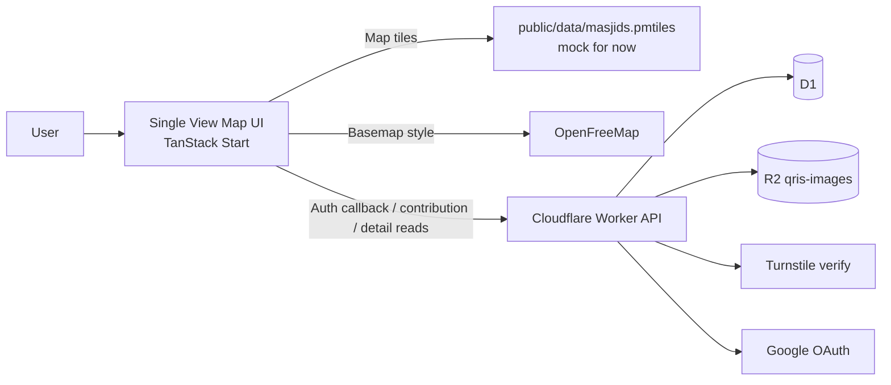
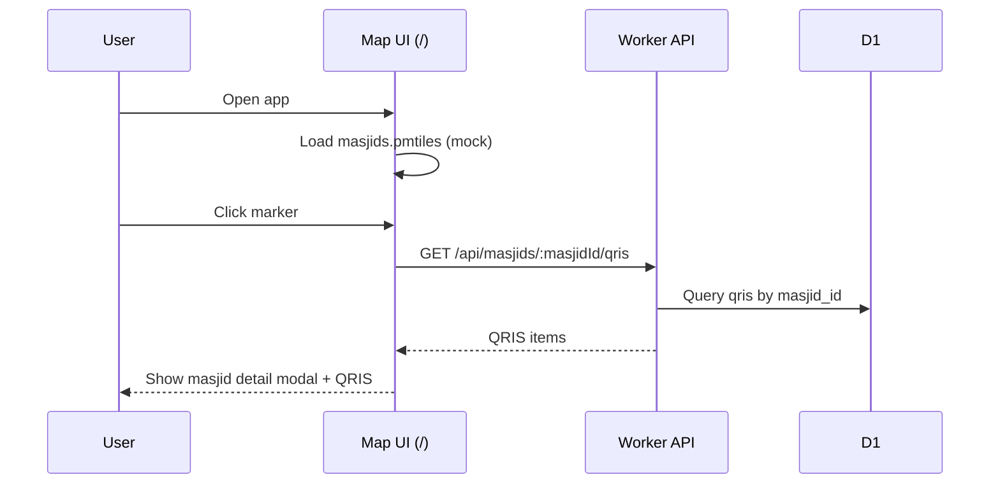
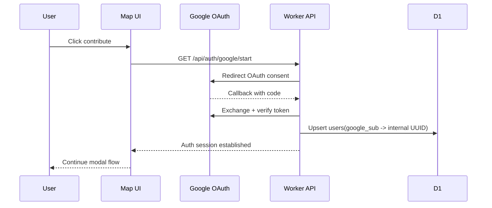
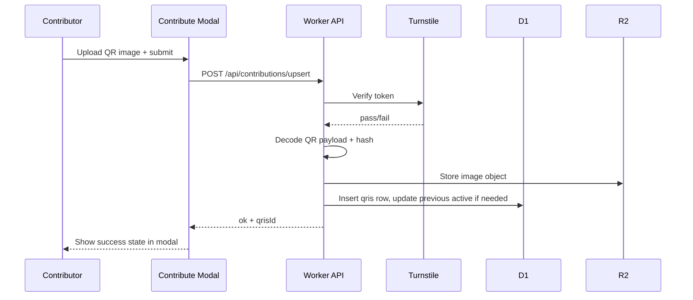

# QRIS Masjid Indonesia - MVP Spec (Hackathon)

Last updated: 2026-03-03  
Status: Draft v2 (revised)

## 1) Product Goal

Build a low-friction, nationwide directory for QRIS donation endpoints for masjid in Indonesia.

Core policy:

- Publish-first.
- Community-submitted.
- Transparency-first confidence model.

## 2) Final Scope (MVP)

- Single-page app experience.
- One frontend route only: `/`.
- All interactions happen as overlays/modals on top of map.
- Data reads from D1 via API.
- Map source from PMTiles mock data first; real data replacement later.

## 3) MVP Snapshot

- Single map view as the full app shell.
- Modal-first interactions for detail and contribution.
- Direct read path from API + D1 for masjid QRIS data.
- Minimal write path with Turnstile and Google-authenticated user session.
- Mock PMTiles committed now; real PMTiles swapped in during handoff.

## 4) Core UX Model

Route:

- `/` (Map Home)

Overlays/modals inside `/`:

- Masjid detail popover/modal (on marker click).
- Contribute flow modal (start -> auth -> upload -> success states in one modal flow).
- Lightweight error/info modal states.

## 5) Data Artifacts

Static assets:

- `public/data/masjids.pmtiles` -> **mock dataset for now**.
- OpenFreeMap style/basemap from external provider.

Runtime persisted assets:

- `R2 qris-images/*` for uploaded QR images.

## 6) Tech Stack

Frontend:

- TanStack Start + TanStack Router
- TanStack Query
- Zod
- MapLibre GL + PMTiles
- Tailwind CSS + shadcn/ui patterns

Backend/runtime:

- Cloudflare Workers (TanStack Start server routes/functions)
- Cloudflare D1
- Cloudflare R2
- Google OAuth callback flow
- Cloudflare Turnstile

Data/migrations:

- Drizzle ORM + drizzle-kit (default)
- Atlas deferred (optional later for CI governance)

Tooling:

- Bun
- TypeScript strict
- oxlint + oxfmt
- Vitest

Architecture style:

- FSD-inspired structure (`app`, `pages`, `features`, `entities`, `shared`)

## 7) Architecture



## 8) ERD (Final MVP)

Tables: `users`, `masjids`, `qris`

```mermaid
erDiagram
  users {
    text id PK
    text google_sub UNIQUE
    text email
    datetime created_at
    datetime last_seen_at
    integer is_blocked
  }

  masjids {
    text id PK
    text osm_id
    text name
    real lat
    real lon
    text city
    text province
    text source_version
    datetime created_at
    datetime updated_at
  }

  qris {
    text id PK
    text masjid_id FK
    text payload_hash
    text image_r2_key
    text contributor_id FK
    datetime created_at
    datetime updated_at
    integer is_active
  }

  users ||--o{ qris : submits
  masjids ||--o{ qris : has
```

Notes:

- `users.id` is internal UUID.
- Google `sub` is used only for identity mapping at auth boundary.
- `masjids` seeded from PMTiles source pipeline.
- `qris` supports 1-to-many history/future extension; MVP UI can read only active/latest.

## 9) Frontend Features

Count: 1 route, 5 primary UI blocks.

UI blocks:

- Fullscreen map canvas.
- Search/filter bar.
- Marker interaction + masjid detail modal.
- Contribute modal flow (multi-step state machine inside one modal).
- Toast/inline feedback for success/failure.

## 10) Backend API Contracts (MVP)

### 10.1 Google auth start

`GET /api/auth/google/start`

Behavior:

- Generate OAuth state.
- Set short-lived state cookie.
- Redirect browser to Google OAuth consent URL.

### 10.2 Google auth callback

`GET /api/auth/google/callback?code=...&state=...`

Behavior:

- Exchange code with Google.
- Verify identity.
- Upsert `users` by `google_sub`.
- Create app session (cookie/token).
- Redirect to `/?contribute=1&auth=ok`.

### 10.3 Read QRIS for a masjid

`GET /api/masjids/:masjidId/qris`

Response (example):

```json
{
  "masjidId": "masjid_123",
  "items": [
    {
      "id": "qris_abc",
      "payloadHash": "sha256:...",
      "imageUrl": "https://<r2-public-or-signed-url>",
      "isActive": true,
      "updatedAt": "2026-03-03T12:00:00Z"
    }
  ]
}
```

### 10.4 Upsert contribution

`POST /api/contributions/upsert`

Request:

```json
{
  "masjidId": "masjid_123",
  "imageBase64": "...",
  "turnstileToken": "..."
}
```

Response:

```json
{
  "ok": true,
  "qrisId": "qris_abc",
  "masjidId": "masjid_123"
}
```

## 11) Core Flows (Sequence)

### A) Browse map and view masjid QRIS



### B) Login via Google callback



### C) Contribute via modal



## 12) Anti-abuse Controls

- Turnstile required for contribution write path.
- Server-side token validation.
- Basic rate limiting (IP + user).
- Blocked users check (`users.is_blocked`).
- Reject invalid/non-decodable QR images.
- Reject non-QRIS QR payloads via EMV TLV validation.
- Enforce CRC validation for QRIS payload before D1/R2 write.

## 13) PMTiles Pipeline (Mock now, real later)

Current MVP:

- Commit mock `public/data/masjids.pmtiles` so app runs immediately.

Later handoff:

1. Cofounder prepares real Indonesia masjid dataset.
2. Convert source -> MBTiles.
3. Convert MBTiles -> PMTiles.
4. Replace `public/data/masjids.pmtiles`.
5. Bump `masjids.source_version` as needed.

Example shape:

```bash
pmtiles convert masjids.mbtiles public/data/masjids.pmtiles
```

## 14) Performance Targets (MVP)

- First map render < 2.5s on mid-tier mobile.
- Marker click to modal data < 500ms p95.
- Contribution submit < 2s p95 excluding upload network variance.

## 15) Implementation Plan Snapshot

1. Scaffold TanStack Start (Cloudflare target).
2. Build single-route map shell.
3. Add PMTiles integration with mock file.
4. Implement modal-only masjid detail + contribute flow.
5. Add D1 schema (`users`, `masjids`, `qris`) + Drizzle migration.
6. Implement 3 APIs above.
7. Wire auth callback and session.
8. Ship MVP and handoff real PMTiles replacement to cofounder.

## 16) Source References

- TanStack Start: https://tanstack.com/start/docs/overview
- TanStack Router file-based routing: https://tanstack.com/router/v1/docs/framework/react/routing/file-based-routing
- OpenFreeMap quick start: https://openfreemap.org/quick_start/
- PMTiles + MapLibre: https://docs.protomaps.com/pmtiles/maplibre
- MapLibre PMTiles example: https://maplibre.org/maplibre-gl-js/docs/examples/pmtiles-source-and-protocol/
- Drizzle + D1: https://orm.drizzle.team/docs/connect-cloudflare-d1
- Cloudflare Turnstile server validation: https://developers.cloudflare.com/turnstile/get-started/server-side-validation/
