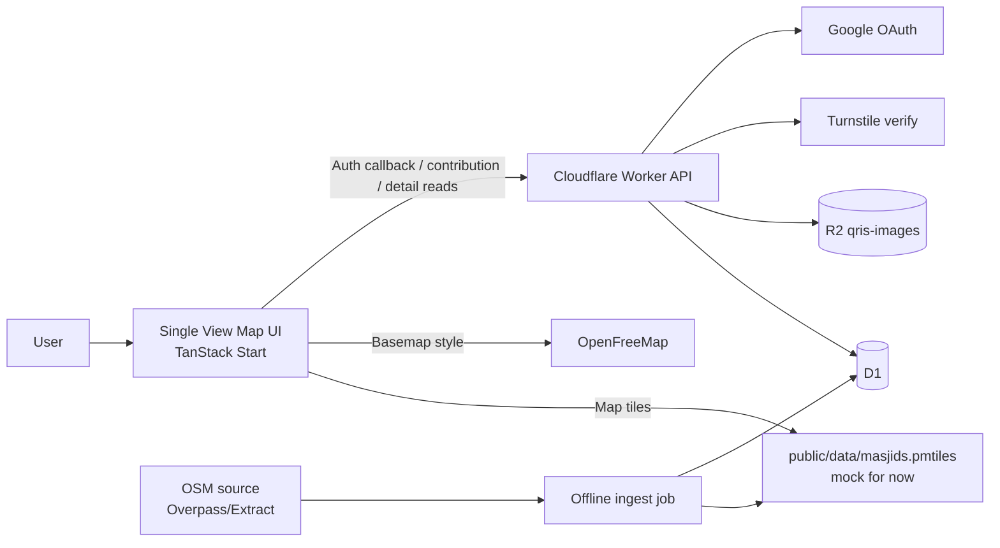
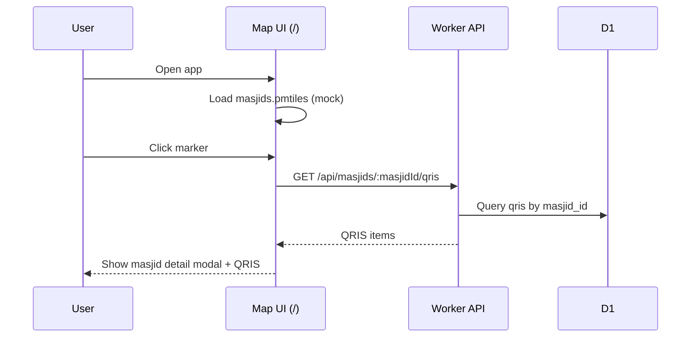
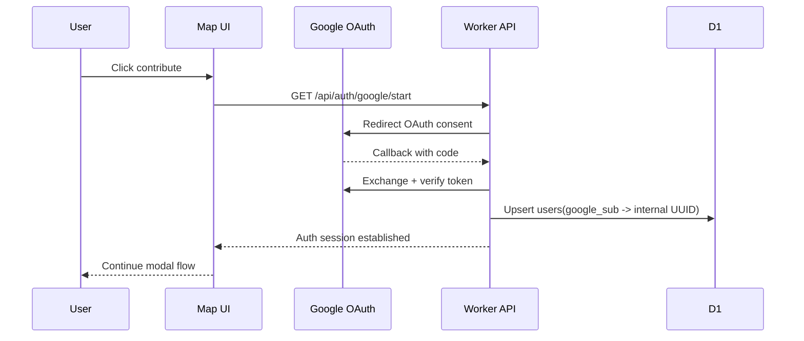
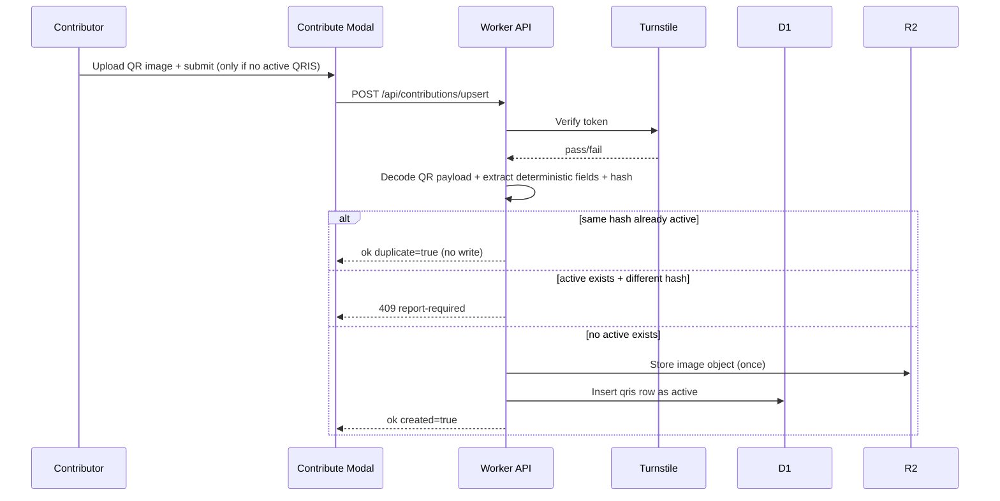
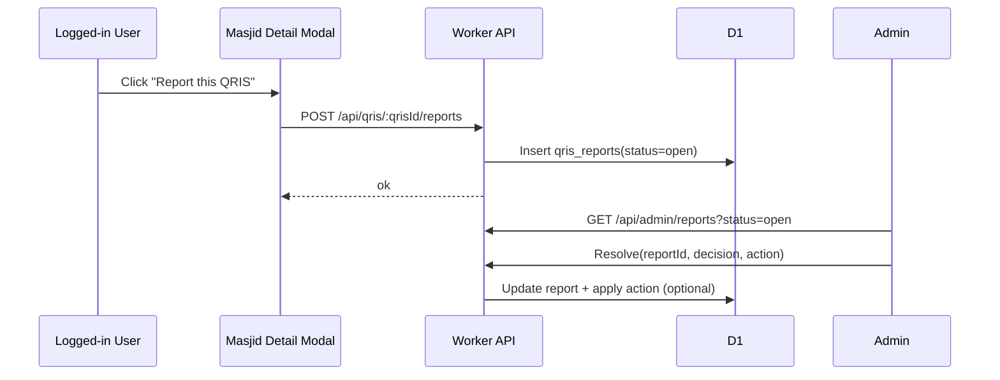

# QRIS Masjid Indonesia - MVP Spec (Hackathon)

Last updated: 2026-03-04  
Status: Draft v5 (idempotent upload + report-gated replacement)

## 1) Product Goal

Build a low-friction, nationwide directory for QRIS donation endpoints for masjid in Indonesia.

Core policy:

- Publish-first.
- Community-submitted.
- Transparency-first confidence model.

## 2) Final Scope (MVP)

- Single-page app experience.
- One frontend route only: `/`.
- All interactions happen as overlays/modals on top of map.
- Data reads from D1 via API.
- Map source from PMTiles mock data first; real data replacement later.

## 3) MVP Snapshot

- Single map view as the full app shell.
- Modal-first interactions for detail and contribution.
- Direct read path from API + D1 for masjid QRIS data.
- Minimal write path with Turnstile and Google-authenticated user session.
- Mock PMTiles committed now; real PMTiles swapped in during handoff.

## 4) Core UX Model

Route:

- `/` (Map Home)

Overlays/modals inside `/`:

- Masjid detail popover/modal (on marker click).
- Contribute flow modal (start -> auth -> upload -> success states in one modal flow).
- Lightweight error/info modal states.

## 5) Data Artifacts

Static assets:

- `public/data/masjids.pmtiles` -> **mock dataset for now**.
- OpenFreeMap style/basemap from external provider.

Runtime persisted assets:

- `R2 qris-images/*` for uploaded QR images.

## 6) Tech Stack

Frontend:

- TanStack Start + TanStack Router
- TanStack Query
- Zod
- MapLibre GL + PMTiles
- Tailwind CSS + shadcn/ui patterns

Backend/runtime:

- Cloudflare Workers (TanStack Start server routes/functions)
- Cloudflare D1
- Cloudflare R2
- Google OAuth callback flow
- Cloudflare Turnstile

Data/migrations:

- Drizzle ORM + drizzle-kit (default)
- Atlas deferred (optional later for CI governance)

Tooling:

- Bun
- TypeScript strict
- oxlint + oxfmt
- Vitest

Architecture style:

- FSD-inspired structure (`app`, `pages`, `features`, `entities`, `shared`)

## 7) Architecture



Data source policy:

- Client never calls Overpass.
- Worker API never proxies end-user Overpass requests.
- Overpass/OSM is used only by offline ingest jobs (build-time or scheduled sync).
- App runtime reads only from internal artifacts (`PMTiles`, `D1`).

## 8) ERD (Ops-first MVP, storage-tight)

Tables: `users`, `masjids`, `qris`, `qris_reports`

```mermaid
erDiagram
  users {
    text id PK
    text google_sub UNIQUE
    text email
    datetime created_at
    datetime last_seen_at
    integer is_blocked
  }

  masjids {
    text id PK
    text osm_id
    text name
    real lat
    real lon
    text city
    text province
    text source_version
    datetime created_at
    datetime updated_at
  }

  qris {
    text id PK
    text masjid_id FK
    text payload_hash
    text merchant_name
    text merchant_city
    text point_of_initiation_method
    text nmid_nullable
    text image_r2_key
    text contributor_id FK
    datetime created_at
    datetime updated_at
    integer is_active
  }

  qris_reports {
    text id PK
    text qris_id FK
    text masjid_id FK
    text reporter_id FK
    text reason_code
    text reason_text
    text status
    text reviewed_by_nullable
    text resolution_note_nullable
    datetime reviewed_at_nullable
    datetime created_at
    datetime updated_at
  }

  users ||--o{ qris : submits
  users ||--o{ qris_reports : reports
  masjids ||--o{ qris : has
  masjids ||--o{ qris_reports : receives
  qris ||--o{ qris_reports : flagged_by
```

Notes:

- `users.id` is internal UUID.
- Google `sub` is used only for identity mapping at auth boundary.
- `masjids` seeded from PMTiles source pipeline.
- `qris` supports sparse history; new row is created only for first publish or approved replacement.
- Exactly one active row per masjid.
- `qris` should enforce unique (`masjid_id`, `payload_hash`) to prevent duplicate rows for same payload.
- Raw payload is not persisted in cleartext; parse + validate at ingest, then store normalized derivatives only.
- `nmid_nullable` is optional because not all decoded payload variants expose it consistently.
- `qris_reports.status`: `open` | `dismissed` | `confirmed`.
- Enforce one open report per (`reporter_id`, `qris_id`) to reduce spam duplicates.
- R2 object key should be deterministic by payload hash (`qris/{masjidId}/{payloadHash}`) to avoid duplicate image objects.

## 9) Frontend Features

Count: 1 route, 5 primary UI blocks.

UI blocks:

- Fullscreen map canvas.
- Search/filter bar.
- Marker interaction + masjid detail modal.
- Contribute modal flow (only visible when no active QRIS for selected masjid, includes Turnstile challenge).
- Report CTA for active QRIS item.
- Toast/inline feedback for success/failure.

## 10) Backend API Contracts (MVP)

### 10.1 Google auth start

`GET /api/auth/google/start`

Behavior:

- Generate OAuth state.
- Set short-lived state cookie.
- Redirect browser to Google OAuth consent URL.

### 10.2 Google auth callback

`GET /api/auth/google/callback?code=...&state=...`

Behavior:

- Exchange code with Google.
- Verify identity.
- Upsert `users` by `google_sub`.
- Create app session (cookie/token).
- Redirect to `/?contribute=1&auth=ok`.

### 10.3 Read QRIS for a masjid

`GET /api/masjids/:masjidId/qris`

Response (example):

```json
{
  "masjidId": "masjid_123",
  "hasActiveQris": true,
  "canUpload": false,
  "uploadPolicy": "report-first",
  "items": [
    {
      "id": "qris_abc",
      "payloadHash": "sha256:...",
      "merchantName": "MASJID DARUL ILMI UMK",
      "merchantCity": "KUDUS",
      "pointOfInitiationMethod": "11",
      "nmid": "ID1021117325659",
      "imageUrl": "https://<r2-public-or-signed-url>",
      "isActive": true,
      "updatedAt": "2026-03-03T12:00:00Z"
    }
  ]
}
```

### 10.4 Upsert contribution

`POST /api/contributions/upsert`

Rule:

- Full normalized payload hash is the identity key.
- Same hash + same masjid => idempotent success, no DB insert, no R2 write.
- Different hash while active QRIS exists => reject (`409`) and ask reporter flow first.
- Insert/write happens only when there is no active QRIS.

Request:

```json
{
  "masjidId": "masjid_123",
  "imageBase64": "...",
  "turnstileToken": "..."
}
```

Response A (created):

```json
{
  "ok": true,
  "duplicate": false,
  "created": true,
  "qrisId": "qris_abc",
  "masjidId": "masjid_123"
}
```

Response B (idempotent duplicate):

```json
{
  "ok": true,
  "duplicate": true,
  "created": false,
  "qrisId": "qris_existing",
  "masjidId": "masjid_123"
}
```

Response C (active exists but different payload):

```json
{
  "ok": false,
  "code": "ACTIVE_QRIS_EXISTS_REPORT_REQUIRED",
  "masjidId": "masjid_123",
  "activeQrisId": "qris_existing"
}
```

HTTP status: `409`.

### 10.5 Report a QRIS item (exception path)

`POST /api/qris/:qrisId/reports`

Auth:

- Login required.

Request:

```json
{
  "reasonCode": "merchant-name-mismatch",
  "reasonText": "App shows personal name, not masjid operator."
}
```

Response:

```json
{
  "ok": true,
  "reportId": "report_123",
  "status": "open"
}
```

### 10.6 Admin review queue (minimal ops API)

`GET /api/admin/reports?status=open`

`POST /api/admin/reports/:reportId/resolve`

Resolve payload:

```json
{
  "decision": "dismissed | confirmed",
  "qrisAction": "none | deactivate_qris",
  "userAction": "none | block_user",
  "resolutionNote": "optional audit note"
}
```

Hard delete policy:

- No delete operation in routine moderation API.
- Hard delete is reserved for explicit compliance/privacy purge workflow only.

## 11) Core Flows (Sequence)

### A) Browse map and view masjid QRIS



### B) Login via Google callback



### C) Contribute via modal



### D) Report and admin moderation (exception)



## 12) Anti-abuse Controls

- Turnstile required for contribution write path.
- Server-side token validation.
- Basic rate limiting (IP + user).
- Blocked users check (`users.is_blocked`).
- Reject invalid/non-decodable QR images.
- Reject non-QRIS QR payloads via EMV TLV validation.
- Enforce CRC validation for QRIS payload before D1/R2 write.
- Report path is login-only and rate-limited.
- Deduplicate open report per user per qris item.

## 13) Governance Model (Simple, YAGNI)

Objective:

- Deterministic ingest + exception handling.
- Publish-first remains (`2b`), without heavy probabilistic trust scoring.
- Human (or AI agent) admin reviews only reported exceptions.

Decision note (`1a` vs `1b`):

- `1a` (recommended): trust scoring + targeted review path for anomalies.
- `1b`: full autopublish without governance signal; simpler, but weak incident handling.

Selected direction now:

- Operationally closer to `1b` (no scoring engine) plus report escalation path.
- Upload and replacement are intentionally constrained to reduce churn and storage cost.
- Keep architecture open for future `1a` if data volume/risk requires it.

### 13.1 Deterministic Checks (Hard Validation)

Hard checks (must pass):

- QR image decodable.
- TLV structure valid.
- Payload format indicator `00=01`.
- Country `58=ID`.
- Currency `53=360`.
- Merchant account template includes QRIS GUI (`ID.CO.QRIS.WWW`).
- CRC (`63`) valid.

Output:

- If any hard check fails: reject contribution.
- If hard checks pass: follow idempotent policy below.

### 13.2 Idempotent Upload Policy (Cost Control)

Rules:

1. No active QRIS for masjid: accept insert + store one image object.
2. Active exists and hash is identical: return idempotent success, no write.
3. Active exists and hash differs: return `409 ACTIVE_QRIS_EXISTS_REPORT_REQUIRED`.

Result:

- No duplicate image objects for same payload hash.
- No silent active replacement from random new submissions.

### 13.3 Report-driven Exceptions (Only Mutation Gate)

Principle:

- Do not overfit with inferred trust rules early.
- Accept deterministic-valid data by default.
- Escalate payload-change attempts via explicit reports.

Report metadata:

- `reason_code` required.
- `reason_text` optional.
- Reporter identity always known (authenticated user only).

### 13.4 Admin Resolution

Admin decisions:

- `dismissed`: report is not actionable.
- `confirmed`: report valid; optional enforcement action.

Enforcement actions:

- `none`
- `deactivate_qris`
- `block_user`

Deletion rule:

- Do not hard-delete users in normal abuse handling.
- Prefer `block_user` to retain auditability.
- Hard delete only for explicit legal/privacy requests.

### 13.5 Future Evolution (keep path open)

Deferred capabilities:

- Confidence scoring and badges.
- Multi-contributor consensus.
- External verifier adapters (SNAP/PJP or bilateral partnerships).

### 13.6 External Verifier Path (Future `3b`)

Current (`3a`):

- No external merchant-status API dependency in runtime path.

Future extension (`3b`) without architecture break:

- Add optional `ExternalVerifierAdapter` stage after hard validation.
- Adapter can consume bilateral/B2B rails (for example SNAP/PJP integrations) when available.
- Adapter result can enrich admin review context without becoming a hard runtime dependency.

## 14) Masjid Data Source Strategy + PMTiles Pipeline

Decision:

- Use Overpass/OSM for bootstrap and refresh via offline ingest only.
- Do not rely on Nominatim full import for MVP (too heavy for current scope).
- Do not proxy user traffic to public Overpass from Worker runtime.

Why:

- Runtime dependency on public Overpass risks rate-limit and unstable latency.
- PMTiles + D1 artifacts keep read path deterministic and cheap.
- Matches MVP architecture: static map dataset + API reads from D1.

Ingest modes:

1. Build-time one-shot pull (fast bootstrap).
2. Scheduled backend sync (daily/weekly) writing refreshed artifacts.

Both modes must end with internal artifacts only.

Current MVP:

- Commit mock `public/data/masjids.pmtiles` so app runs immediately.

Later handoff:

1. Pull Indonesia masjid candidates from Overpass/OSM extract in offline job.
2. Normalize + dedupe records (`osm_id`, `name`, `lat/lon`, region tags).
3. Convert normalized source -> MBTiles.
4. Convert MBTiles -> PMTiles.
5. Seed/sync `masjids` in D1 and set `source_version`.
6. Replace `public/data/masjids.pmtiles`.

Example shape:

```bash
pmtiles convert masjids.mbtiles public/data/masjids.pmtiles
```

## 15) Performance Targets (MVP)

- First map render < 2.5s on mid-tier mobile.
- Marker click to modal data < 500ms p95.
- Contribution submit < 2s p95 excluding upload network variance.

## 16) Implementation Plan Snapshot

1. Scaffold TanStack Start (Cloudflare target).
2. Build single-route map shell.
3. Add PMTiles integration with mock file.
4. Implement modal-only masjid detail + contribute flow.
5. Extend D1 schema for extracted QRIS fields in `qris` + unique (`masjid_id`, `payload_hash`).
6. Add `qris_reports` table + moderation states.
7. Extend QRIS parser to extract merchant fields + optional NMID.
8. Implement idempotent contribution path (duplicate hash = no write, active different hash = 409).
9. Implement report API (`POST /api/qris/:qrisId/reports`) with auth + dedupe.
10. Implement minimal admin moderation APIs (`GET/POST /api/admin/reports...`).
11. Hide upload CTA when active exists; show report CTA.
12. Wire auth callback and session.
13. Ship MVP and handoff real PMTiles replacement to cofounder.

## 17) Source References

- TanStack Start: https://tanstack.com/start/docs/overview
- TanStack Router file-based routing: https://tanstack.com/router/v1/docs/framework/react/routing/file-based-routing
- OpenFreeMap quick start: https://openfreemap.org/quick_start/
- PMTiles + MapLibre: https://docs.protomaps.com/pmtiles/maplibre
- MapLibre PMTiles example: https://maplibre.org/maplibre-gl-js/docs/examples/pmtiles-source-and-protocol/
- Drizzle + D1: https://orm.drizzle.team/docs/connect-cloudflare-d1
- Cloudflare Turnstile server validation: https://developers.cloudflare.com/turnstile/get-started/server-side-validation/
- ASPI QRIS security tips (merchant name check): https://aspi-qris.id/tips-aman-bertransaksi-dengan-qris/
- KASPI 2022 (NMID and NMR references): https://www.aspi-indonesia.or.id/wp-content/uploads/2022/07/KASPI-2022_2.pdf
- ASPI bulletin #1 (acquirer validates MID/MPAN/NMID/merchant data): https://www.aspi-indonesia.or.id/wp-content/uploads/2024/08/BULETIN-SPIP-NOMOR-1.pdf
- BI PADG No. 24/1/PADG/2022 (merchant data/NMR governance baseline): https://www.bi.go.id/id/publikasi/peraturan/Pages/PADG_240122.aspx
- BI PADG No. 27/2/PADG/2025 (latest QRIS governance update page): https://www.bi.go.id/id/publikasi/peraturan/Pages/padg_270225.aspx
